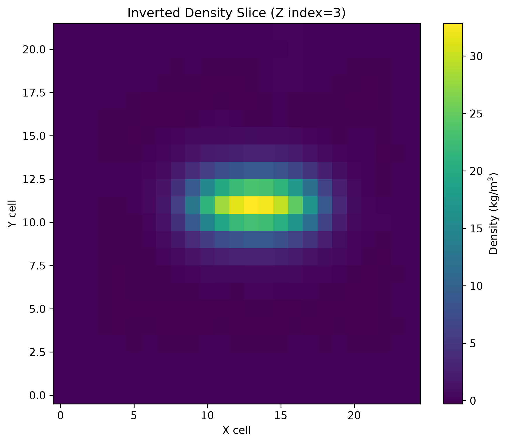
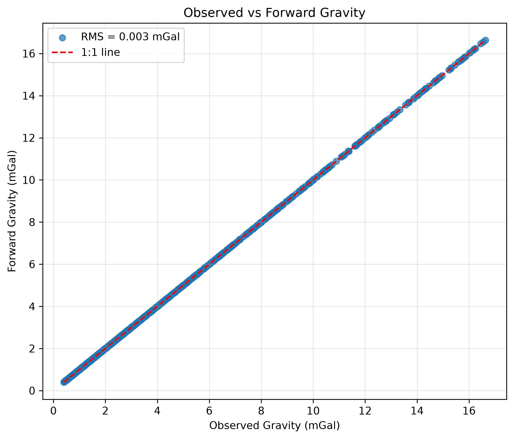
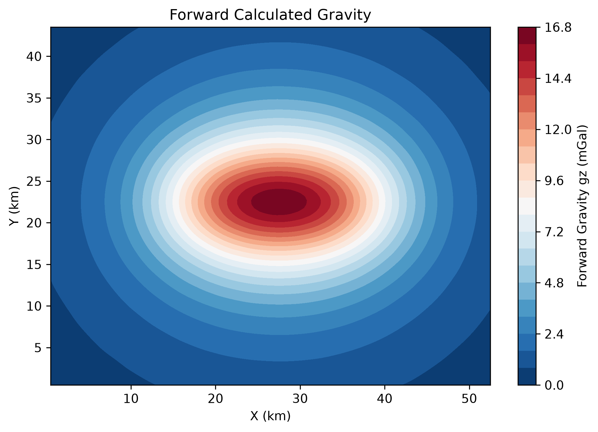

# GravInversionPy

## 3D Gravity Forward Modeling and Tikhonov Inversion in Python

**Author:** Naeim Mousavi

GravInversionPy is an open-source Python package for **3D gravity forward modeling and inversion**.

The package implements **Tikhonov regularization with a 3D smoothness constraint** to recover subsurface density distributions from gravity observations.

---

## Features

GravInversionPy provides tools for:

* Gravity data loading
* Regular grid subsampling
* 3D voxel model generation
* Gravity forward modeling
* Transpose gravity operator
* 3D smoothness regularization
* Tikhonov inversion using the Conjugate Gradient solver
* Density model visualization
* Forward gravity validation plots

---

## Package Structure

```text id="6yrb9r"
GravInversionPy/
│
├── data/
│   └── Gravity_syn.txt
│
├── outputs/
│   ├── density_slice.png
│   ├── observed_vs_forward.png
│   └── gravity_forward_contour.png
│
├── src/
│   └── grav_inversion_py/
│       ├── __init__.py
│       ├── io.py
│       ├── model.py
│       ├── forward.py
│       ├── regularization.py
│       ├── inversion.py
│       └── plotting.py
│
├── examples/
│   └── run_inversion.py
│
├── tests/
│
├── LICENSE
├── README.md
└── pyproject.toml
```

### Main Components

**`src/grav_inversion_py/io.py`**

Functions for loading and preparing gravity observations.

**`src/grav_inversion_py/model.py`**

Functions for constructing the 3D voxel model and associated model parameters.

**`src/grav_inversion_py/forward.py`**

Implementation of the gravity forward operator and forward gravity calculations.

**`src/grav_inversion_py/regularization.py`**

Construction of the 3D smoothness regularization operator.

**`src/grav_inversion_py/inversion.py`**

Tikhonov inversion routines using an iterative Conjugate Gradient solver.

**`src/grav_inversion_py/plotting.py`**

Functions for visualizing density models and comparing observed and forward-calculated gravity.

**`examples/run_inversion.py`**

Example script demonstrating the complete forward-modeling and inversion workflow.

---

# Installation

## Requirements

Recommended environment:

* Python >= 3.12
* NumPy
* SciPy
* Matplotlib

---

## Clone the Repository

Clone the repository:

```bash id="j7n0w5"
git clone https://github.com/nmousavi2020/GravInversionPy.git
```

Move into the project directory:

```bash id="3n6qva"
cd GravInversionPy
```

---

## Install the Package

Install GravInversionPy in editable mode:

```bash id="8hdq3a"
pip install -e .
```

For development, it is recommended to use a virtual environment.

### Create a Virtual Environment

```bash id="z8o7xn"
python -m venv .venv
```

Activate it on Windows:

```bash id="mbg9v1"
.venv\Scripts\activate
```

Activate it on Linux/macOS:

```bash id="d2rq7u"
source .venv/bin/activate
```

Then install the package:

```bash id="5v8p3s"
pip install -e .
```

---

# Quick Start

Run the complete inversion workflow:

```bash id="g0x4xq"
python examples/run_inversion.py
```

The workflow includes:

```text id="a0qz2j"
Gravity Observations
        │
        ▼
Regular Grid Subsampling
        │
        ▼
3D Voxel Model Generation
        │
        ▼
Forward Gravity Calculation
        │
        ▼
Tikhonov Regularized Inversion
        │
        ▼
Recovered Density Model
        │
        ▼
Visualization and Validation
```

---

# Method

The package solves the linear inverse gravity problem:

$$
Gm = d
$$

where:

* **$G$** is the gravity forward operator
* **$m$** is the unknown density model
* **$d$** is the observed gravity data

To stabilize the inversion, GravInversionPy uses Tikhonov regularization with a 3D smoothness constraint:

$$
\left(G^T G + \lambda^2 L^T L\right)m = G^T d
$$

where:

* **$G$** is the gravity forward operator
* **$m$** is the unknown density model
* **$d$** is the observed gravity data
* **$L$** is the 3D smoothness regularization operator
* **$\lambda$** is the regularization parameter

The regularization term promotes smooth spatial variations in the recovered density model and helps reduce the effects of noise and ill-conditioning in the inverse problem.

The solution is obtained using an iterative **Conjugate Gradient (CG)** solver.

---

# Forward Modeling

The forward-modeling component calculates the gravity response generated by the 3D density distribution.

The general workflow is:

```text
3D Density Model
       │
       ▼
Voxel Geometry
       │
       ▼
Gravity Forward Operator
       │
       ▼
Predicted Gravity
```

The calculated gravity can then be compared with the observed gravity data to evaluate the quality of the model.

---

# Regularization

The inversion uses a 3D smoothness constraint to promote physically reasonable spatial variations in the recovered density distribution.

The regularization operator is represented by:

$$
L
$$

and contributes the term:

$$
\lambda^2 L^T L
$$

to the regularized inverse problem.

The regularization parameter $\lambda$ controls the balance between data fitting and model smoothness.

---

# Output Examples

The repository contains example outputs generated by the workflow.

## Inverted Density Model



The density slice visualization shows a representative section through the recovered 3D density model.

---

## Observed vs Forward Gravity



This figure compares the observed gravity data with the gravity response calculated from the recovered density model.

---

## Forward Gravity Map



The forward gravity map shows the spatial distribution of the calculated gravity response.

---

# Data Format

The input gravity data are provided as a text file:

```text id="9j6h0x"
X(km)   Y(km)   gz(mGal)

10.0    5.0     12.5
12.0    5.0     13.1
...
```

The expected columns are:

| Column | Description              | Unit |
| ------ | ------------------------ | ---- |
| `X`    | X coordinate             | km   |
| `Y`    | Y coordinate             | km   |
| `gz`   | Observed gravity anomaly | mGal |

The exact formatting should be compatible with the data-loading functions provided in the package.

---

# Reproducibility

For reproducible results, use consistent:

* Input gravity data
* Model dimensions
* Grid spacing
* Regularization parameters
* Solver settings
* Python version
* Package versions

The example workflow provided in `examples/run_inversion.py` demonstrates the configured inversion procedure.

---

# Scientific Considerations

Gravity inversion is an inherently non-unique and ill-posed geophysical problem.

The recovered density distribution depends on:

* Gravity-data coverage
* Data quality and noise
* Model parameterization
* Voxel dimensions
* Regularization strength
* Smoothness assumptions
* Forward-modeling formulation

Therefore, the recovered density model should be interpreted within the assumptions and limitations of the inversion framework.

---

# Author

**Naeim Mousavi**

GravInversionPy is developed as an open-source Python package for 3D gravity forward modeling, regularized inversion, and subsurface density-model visualization.

---

# Citation

If you use GravInversionPy in research, please cite:

**Mousavi, N. (2026).**

*GravInversionPy: Python tools for 3D gravity forward modeling and Tikhonov inversion.*

A BibTeX entry can be added to the repository if a formal publication or software DOI becomes available.

---

# License

This project is released under the **MIT License**.

See the `LICENSE` file for the complete license text.
